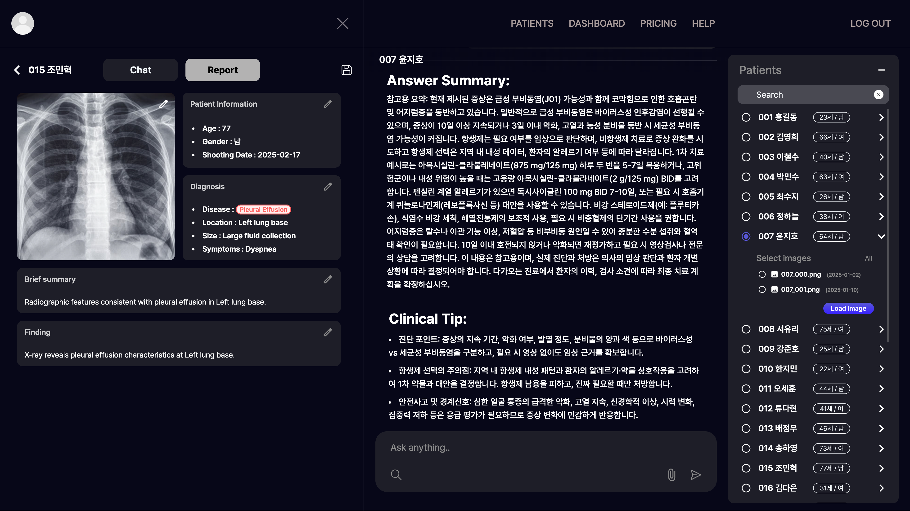
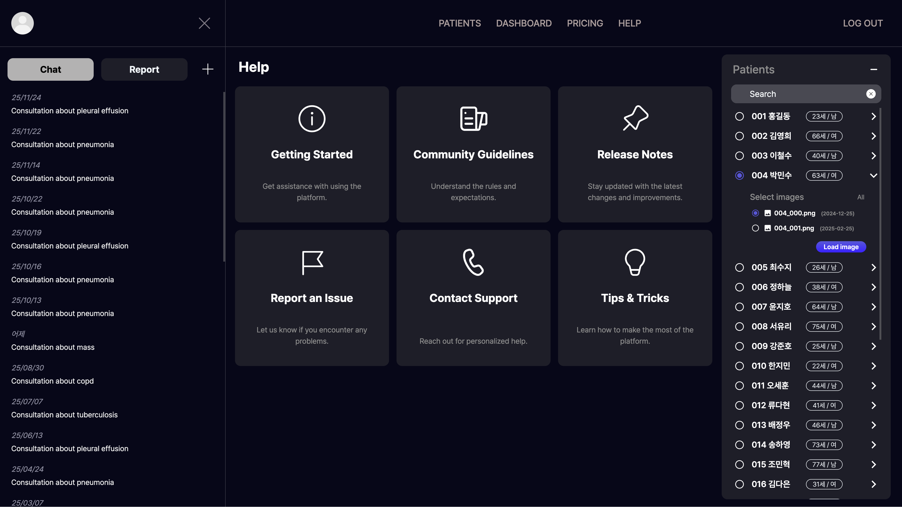
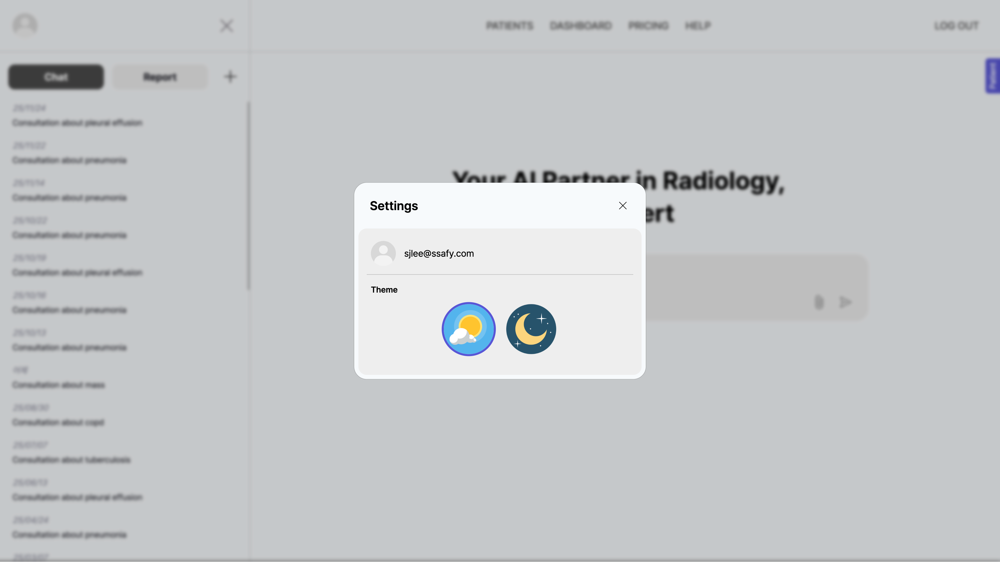
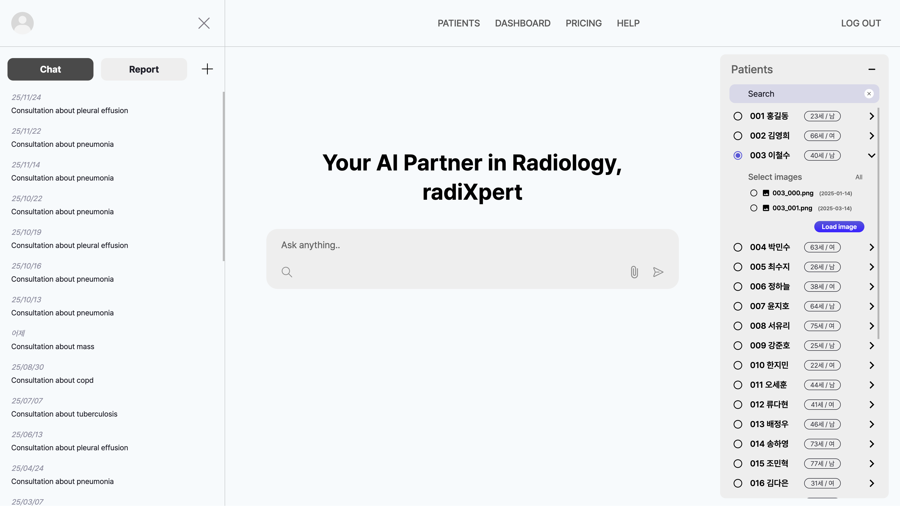

# NewMes/CXR

이 프로젝트는 React와 TypeScript를 기반으로 구축되었으며, Vite를 통해 빠른 개발 환경을 제공합니다.

### 개발 기간

2025.09.15 ~ 2025.09.23.

### 사용 기술 스택

- **프론트엔드**: `React`, `TypeScript`, `Vite`, `Tailwind CSS`, `Zustand`, `Framer Motion`
- **API 통신**: `Axios`
- **외부 API**: `OpenAI API`, `공공데이터포털 API`, `newsAPI`
- **모킹**: `MSW (Mock Service Worker)`
- **버전 관리**: `Git`, `GitHub`
- **코드 품질**: `ESLint`, `Prettier`

## 🚀 설치 및 실행 방법

프로젝트를 로컬 환경에서 실행하기 위한 방법입니다.

**1. 저장소 복제**

```bash
git clone https://github.com/SJLee-0525/NewMes
cd NewMes/NewMes
```

**2. 종속성 설치**

이 프로젝트는 `yarn` 패키지 매니저를 사용합니다.

```bash
npm install yarn --global # yarn이 설치되어 있지 않은 경우 실행

yarn
```

**3. 개발 서버 실행**

아래 명령어를 실행하여 개발 서버를 시작합니다.

```bash
yarn dev
```

서버가 성공적으로 실행되면 `http://localhost:5173`에서 애플리케이션을 확인할 수 있습니다.

## 상태 관리 및 컴포넌트 구조

### 상태 관리

- **Zustand**: 전역 상태 관리를 위해 `Zustand`를 사용합니다. `Zustand`는 문법이 간결하고, 사용법이 간단하며, React의
  Context API보다 성능적으로 이점을 가집니다.

```typescript
// @stores/systemStore.ts
// 좌측 패널, 우측 패널 등의 레이아웃 상태 관리 용도입니다.

interface SystemState {
  // 왼쪽 사이드바 열기/닫기
  leftSidebarOpen: boolean;
  toggleLeftSidebar: () => void;

  // 왼쪽 사이드바에서 선택된 탭 (chat, report)
  leftSidebarSelectedTab: "chat" | "report";
  setLeftSidebarSelectedTab: (tab: "chat" | "report") => void;

  // 선택된 세션 ID
  selectedSessionId: number | null;
  setSelectedSessionId: (sessionId: number | null) => void;

  // 선택된 리포트 ID 및 환자 이름
  selectedReportId: { id: number | null; name: string | null };
  setSelectedReportId: (reportId: number | null, patientName: string | null) => void;

  // 오른쪽 사이드바 열기/닫기
  rightSidebarOpen: boolean;
  toggleRightSidebar: (bool: boolean) => void;

  // 선택된 환자 ID 및 이름, 이미지들
  selectedPatientId: { id: string | null; name: string | null; images: Image[] };
  setSelectedPatientId: (patientId: string | null, patientName: string | null, images: Image[]) => void;
}
```

```typescript
// @stores/modalStore.ts
// 모달 상태 관리를 위한 스토어입니다.

interface ModalState {
  // 설정과 관련된 모달 상태
  isOpen: boolean;
  isClosing: boolean;
  modalContent: React.ReactNode | null;
  openModal: ({ modalContent }: { modalContent: React.ReactNode }) => void;
  closeModal: () => void;

  // 사진 확대 모달 상태
  photoModalIsOpen: boolean;
  photoModalIsClosing: boolean;
  photoModalContent: React.ReactNode | null;
  openPhotoModal: ({ modalContent }: { modalContent: React.ReactNode }) => void;
  closePhotoModal: () => void;
}
```

```typescript
// @stores/authStore.ts
// 사용자 인증 관련 상태 관리를 위한 스토어입니다. 로컬 스토리지와 연동됩니다.

interface AuthStore {
  // 사용자 정보
  user: User | null;
  setUserName: (userData: User | null) => void;
  deleteUser: () => void;

  // 테마 정보
  currentTheme: string;
  setCurrentTheme: (themeClass: string) => void;
}
```

### 컴포넌트 구조

```javascript
src
├─ components       // 재사용 가능한 컴포넌트들
│  ├─ box           // 공용 박스 컴포넌트
│  ├─ button        // 공용 버튼 컴포넌트
│  ├─ input         // 공용 입력 컴포넌트
│  ├─ modal         // 공용 모달 컴포넌트
│  ├─ nav           // 공용 네비게이션 컴포넌트
│  ├─ preview       // 공용 미리보기 컴포넌트
│  └─ unavailable   // 공용 사용 불가 컴포넌트
│
├─ layout           // 레이아웃 컴포넌트
│  └─ panel
│     ├─ leftPanel  // 좌측 패널 컴포넌트
│     └─ rightPanel // 우측 패널 컴포넌트
│
└─ pages            // 페이지 컴포넌트
   ├─ auth          // 인증 관련 페이지
   ├─ chat          // 채팅 페이지
   ├─ dashboard     // 대시보드 페이지
   ├─ help          // 도움말 페이지
   ├─ pricing       // 가격 페이지
   └─ settings      // 설정 페이지

```

## 🖥️ UI 주요 화면 설명

아래는 애플리케이션의 주요 화면과 그 설명입니다.

### 메인 페이지


- AI와 실시간으로 대화하며 메시지를 생성하는 메인 채팅 화면입니다.
- 좌측 패널에서 최근 대화 세션과 환자 리포트를 선택할 수 있습니다.
- 우측 패널에서는 선택한 환자의 이미지와 정보를 확인할 수 있습니다.
- 우측 패널에서 환자를 선택하면, 해당 환자 정보로 대화를 시작할 수 있습니다.
- 우측 패널에서 이미지를 클릭하면, 이미지를 대화창에 삽입할 수 있습니다.


- 좌측 패널에서 상병 검색 기능을 통해 자주 사용하는 상병명을 빠르게 찾을 수 있습니다.
- 검색 결과를 클릭하면, 해당 상병명이 대화창에 삽입됩니다.

### 대화 페이지


- 선택한 대화 세션의 상세 메시지 내역을 확인할 수 있습니다.
- 우측 패널에서 이미지를 클릭하여 대화창에 삽입할 수 있습니다.


- 이미지 클릭 시, 확대된 이미지를 모달로 확인할 수 있습니다.

### 리포트 페이지



- 환자 리포트 목록을 확인할 수 있습니다.
- 저장 아이콘을 누르면, 해당 리포트를 pdf로 다운로드 하거나 프린트할 수 있습니다.


- 실제 저장된 pdf 리포트 예시입니다.

### DASHBOARD 페이지


- 최신 헬스 뉴스를 확인할 수 있습니다.
- 뉴스를 클릭하면 새 탭에서 원문을 확인할 수 있습니다.
- 최상단에서 스크롤을 통해 뉴스 목록 새로고침을 할 수 있습니다.

### PRICING 페이지


- 서비스의 요금제를 확인할 수 있습니다.
- 각 요금제의 특징과 가격을 비교할 수 있습니다.

### HELP 페이지



- 자주 묻는 질문(FAQ)과 고객 지원 정보를 제공합니다.

### SETTINGS 페이지



- 사용자 프로필 정보와 테마 설정을 관리할 수 있습니다.
- 라이트 모드와 다크 모드를 선택할 수 있습니다.



- 라이트 모드에서의 메인 페이지 화면입니다.

## ✨ UX/UI 고려 사항

- **애니메이션 효과**: `Framer Motion`과 `CSS keyframes` 등을 활용하여 컴포넌트 전환 및 사용자 인터랙션에 부드러운
  애니메이션을 추가하여 부드러운 사용 경험을 제공합니다.
- **다양한 미리보기**: 사용자가 굳이 클릭하지 않더라도, 마우스를 가져다 대는 것만으로도 다양한 내용을 미리 확인할 수
  있습니다. (예: 대화 기록 -> 대화 상대, 이미지 -> 이미지 미리보기 등)
- **실시간 피드백**: 사용자가 메시지를 입력하고 AI가 응답하는 과정에서 로딩 상태 등을 시각적으로 제공하여 대기 시간을
  지루하지 않게 만들었습니다.
- **단축키 지원**: 상병 검색 등 자주 사용하는 기능에 대해 단축키를 지원하여 사용 편의성을 높였습니다. (채팅 입력 중,
  shift + 윗방향키)
- **일관된 디자인 시스템**: `Tailwind CSS`를 사용하여 빠른 개발과 일관된 디자인을 적용했습니다.
- **테마 지원**: 사용자가 선호하는 테마(라이트/다크 모드)를 선택할 수 있도록 하여 다양한 환경에서 편안한 사용 경험을
  제공합니다.

## 💡 확장 아이디어

- **맞춤형 메시지 생성**: 백엔드 시스템과 연동하여 환자의 과거 기록, 알레르기 정보, 현재 복용 중인 약물 등을 기반으로
  맞춤형 메시지를 생성하는 기능을 추가할 수 있습니다.
